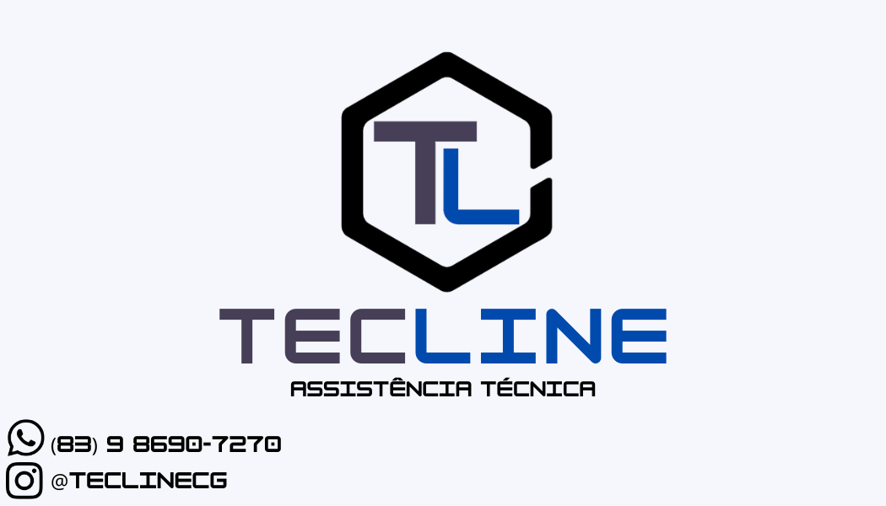
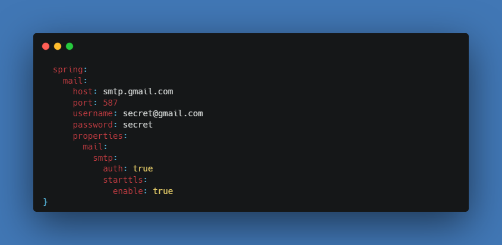
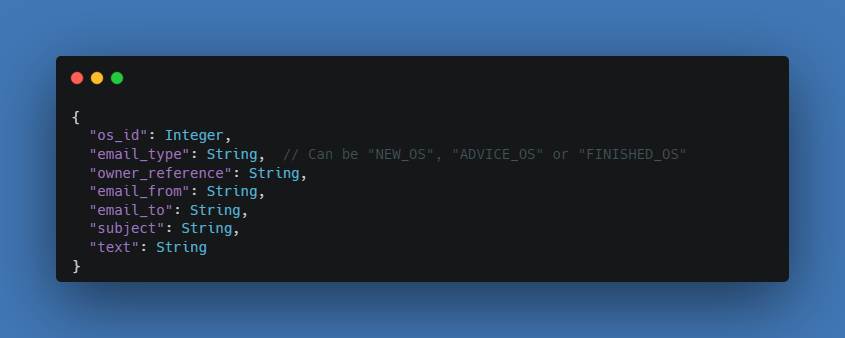
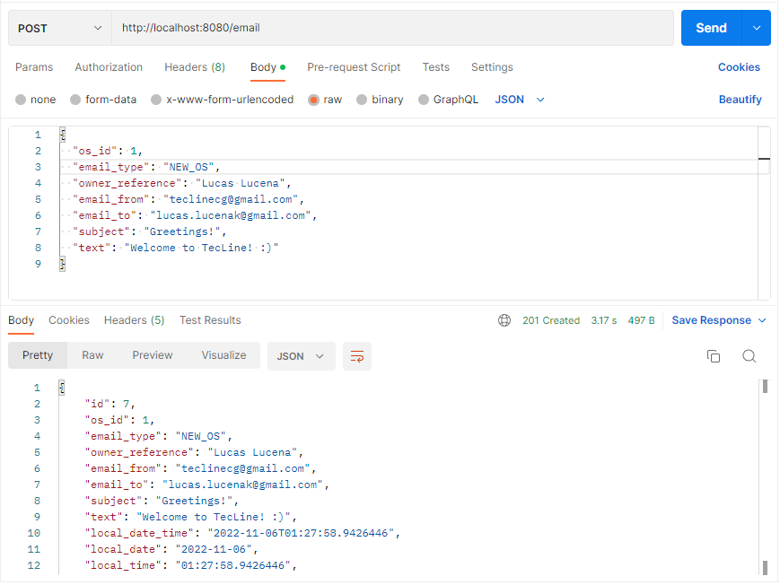

# TecLine E-mail Sender Microservice

In addition to my necessity to manage my own technical assistance I have observed that I can extend that idea with Spring Mail! This Microservice can send any e-mail to my clients, with work orders information and their status, can also send a Greek Meetings e-mail if they are new.

# Nested Gmail SMTP Server from  mai/2022
After some searches I've got the conclusion that the Gmail's SMPT server is not useful anymore, because the sender's mail need to enable the "Allow less secure apps" option and from mai/2022 the Gmail announced that this option will get removed.
So because of that, this microservice will not work by using Gmail's SMTP server.

## Usage
To use that microservice, you need to create a PostgreSQL database called "os_mail_system".

### Set the application.yml
You need to set your email and respective password at the application.yml, as the following example:

### Body JSON Request

### Example Using Postman:

## Contributing
Pull requests are welcome. For major changes, please open an issue first to discuss what you would like to change.
Please make sure to update tests as appropriate.

## License
[MIT](https://choosealicense.com/licenses/mit/)
